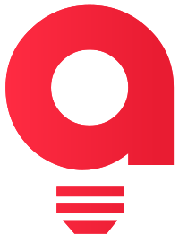

 

---

##  Sobre mim

Sou o **Janderson**, desenvolvedor **Full Stack** com mais de **10 anos** construindo aplicações web robustas, APIs escaláveis e automações. Fundador da **A23 Tech**, onde transformo processos manuais e ideias em software que roda de verdade.

- 🔧 **Backend** com Node.js, PHP (Laravel, CodeIgniter), C# e Python
- 🎨 **Frontend** moderno com Vue 3 / Nuxt, React e React Native
- 🗄️ **Dados & infra** com MySQL, PostgreSQL e ambientes Linux/Apache
- 🤖 Curioso de plantão com **automações** e experimentos em **Machine Learning**
- 🌍 Inglês intermediário para reuniões técnicas e colaboração com times internacionais

> "Software de prateleira faz a sua empresa se adaptar a ele. Eu faço o software se adaptar à sua empresa."

---

##  Sobre a A23 Tech

A **A23 Tech** (antiga A23 Comunicações) nasceu em **2016**, no quarto dos fundos da casa da minha vó, como o sonho de um dia ser reconhecido. Começou como uma "eugência" — agência de um funcionário só. 😄

Quase **uma década** depois, virou uma software house que projeta e desenvolve **sistemas sob medida, sites e automações** para empresas que querem crescer sem multiplicar trabalho manual. O nome mudou de _Comunicações_ para _Tech_ porque foi isso que a gente virou: **tecnologia, do site ao sistema inteiro.**

`Diagnóstico` → `Proposta` → `Desenvolvimento` → `Entrega & Suporte`

---

##  Stack

#### Frontend

  
  
  
  
  
  
  
  

#### Backend

  
  
  
  
  
  
  
  

#### Mobile

  
  

#### Dados, Infra & Ferramentas

  
  
  
  
  
  
  

---

##  Métricas

  

<picture>
  <source media="(prefers-color-scheme: dark)" srcset="https://github-profile-summary-cards.vercel.app/api/cards/repos-per-language?username=janderson-fagner&theme=github_dark" />
  
</picture>
<picture>
  <source media="(prefers-color-scheme: dark)" srcset="https://github-profile-summary-cards.vercel.app/api/cards/most-commit-language?username=janderson-fagner&theme=github_dark" />
  
</picture>

<picture>
  <source media="(prefers-color-scheme: dark)" srcset="https://github-profile-summary-cards.vercel.app/api/cards/stats?username=janderson-fagner&theme=github_dark" />
  
</picture>
<picture>
  <source media="(prefers-color-scheme: dark)" srcset="https://github-profile-summary-cards.vercel.app/api/cards/productive-time?username=janderson-fagner&utcOffset=-3&theme=github_dark" />
  
</picture>

---

##  Vamos conversar?

Conte o que trava o seu negócio hoje — a A23 Tech responde em até **1 dia útil**.

